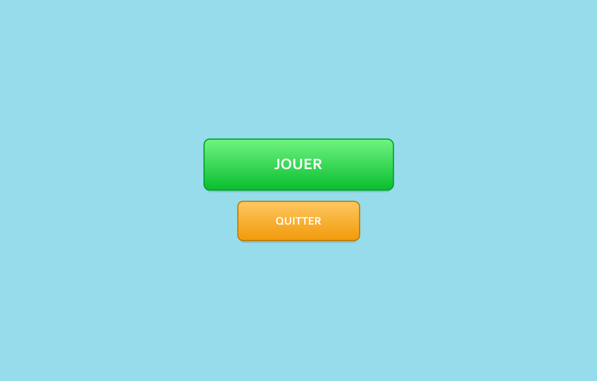
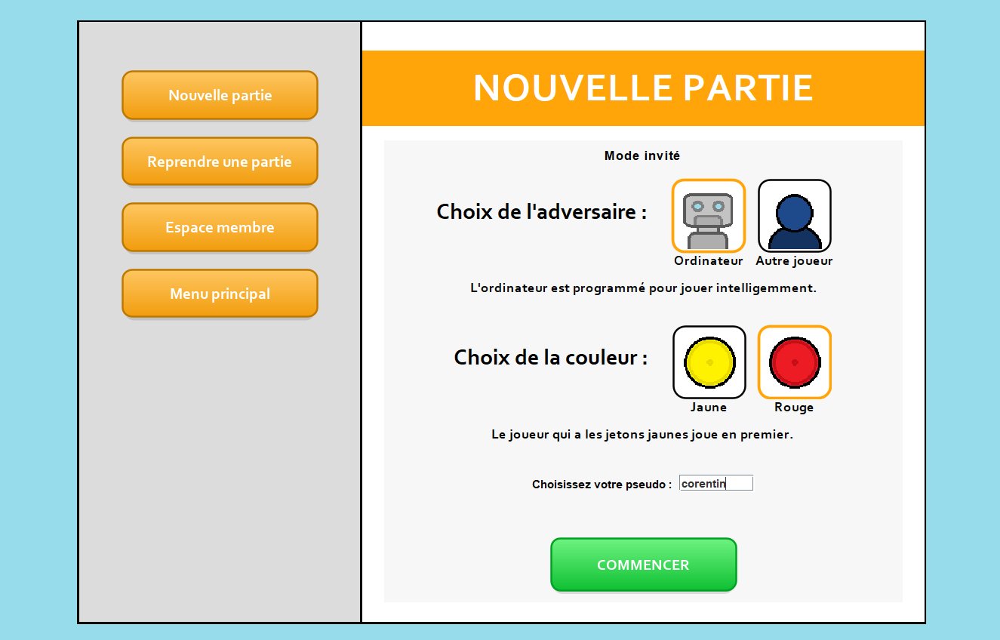
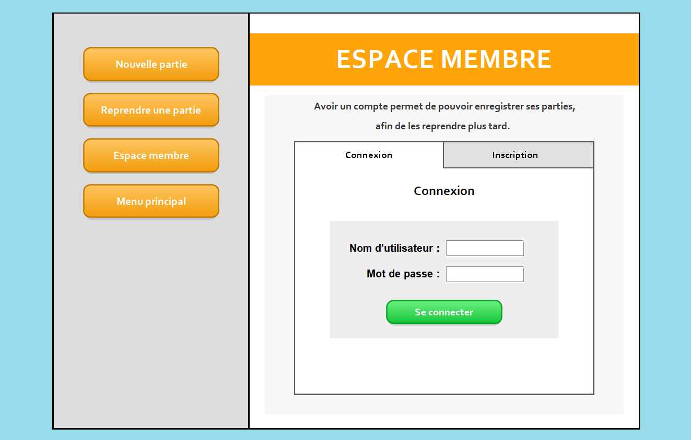
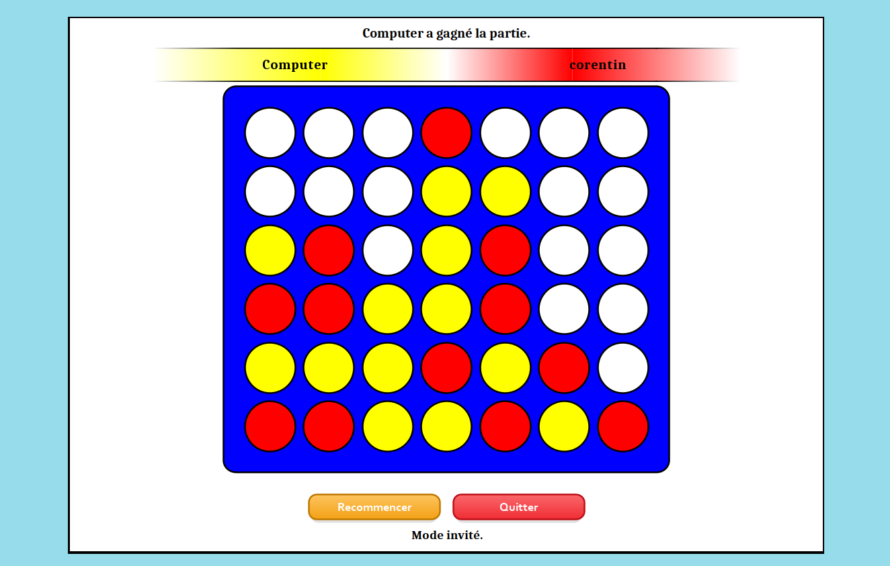

## Présentation

Ce projet est une application du célèbre jeu Puissance 4, réalisée dans le cadre d'un projet scolaire en 2021. L'application est entièrement codée en Java.

## Fonctionnalités

Cette application permet de jouer au jeu Puissance 4. Il est possible de jouer en tant qu'invité, contre un ordinateur ou contre un autre joueur. 
L'application comporte un espace membre qui permet de se créer un compte. Une fois inscrit, il est possible d'enregistrer ses parties pour les reprendre plus tard.

## Détails techniques

- Nous avons utilisé les librairies **Swing** et **Awt** pour créer l'interface graphique. Nous avons créé de nombreux éléments personnalisés pour obtenir un design attractif.

<p align="center">
  
  
</p>
<p align="center">
  
  
</p>

- Les différentes sessions et l'enregistrement des parties sont gérés grâce aux classes **BufferedReader** et **BufferedWriter** qui permettent de manipuler des fichiers textes.


- L'ordinateur est programmé pour jouer intelligemment grâce à l'algorithme **MinMax**, qui lui permet de voir jusqu'à 5 coups en avance afin de choisir le meilleur.

## Lancement du jeu

Le fichier principal du jeu est `scr/App.java`. Pour lancer l'application :


1) Naviguez dans le dossier `src` :
```bash
cd src
```

2) Compilez le code avec la commande suivante :
```bash
javac -d ../bin App.java
```

3) Puis lancez l'application avec la commande :
```bash
java -cp ../bin App
```


## Auteurs

- Corentin CLUET, cluetcorentin@gmail.com

- Yann Marchelli, yann.marchelli@live.fr
